**Car Benz** is a desktop application built with Flutter (version 3.22.3) designed to streamline car service management. The project features a beautiful UI, local storage using SQFLite, PDF invoice generation, localization support for both Arabic and English, and much more.

## Repository
Find the project repository here: [Car Benz GitHub Repo](https://github.com/MhmdMhros/benz.git) 

## Getting Started
Follow these steps to download and run the application:

### Prerequisites
- Flutter SDK 3.22.3
- Dart SDK
- Git
### Clone the Repository
```
git clone https://github.com/MhmdMhros/benz.git
cd benz
```

### Install Dependencies
```
flutter pub get
```

### Run the Application
To run the application, use the following command:
```
flutter run
```

### Build for Desktop

1. **Windows**:
```
		flutter build windows
```
2. **macOS**:
```
		flutter build macos
```
3. **Linux**:
```
		flutter build linux
```

## Application Features

- **Stunning UI Design**: An intuitive interface that enhances user experience.
- **Custom Fonts**: Integrated fonts to elevate visual aesthetics and readability.
- **Local Storage**: Powered by SQFLite for fast and secure data management.
- **PDF Invoice Generation**: Seamlessly generate invoices for car services.
- **Localization**: Supports both Arabic and English languages.
- **Clean Code Practices**: Adhering to best coding standards to ensure maintainability.
- **Shared Preferences**: Persistent storage for user settings.
- **Agile Methodologies**: Development process following agile principles for iterative progress.
- **Version Control**: Managed through Git and GitHub for seamless collaboration.

## Non-Functional Features

- **Usability**: Easy-to-use interface designed for smooth user interactions.
- **Maintainability**: Clean code practices ensuring easy updates and improvements.
- **Reliability**: Robust and stable, delivering high performance consistently.
- **Scalability**: Designed to handle increased user load and data volume.
- **Portability**: Can be built and deployed across various desktop platforms.

## Screenshots

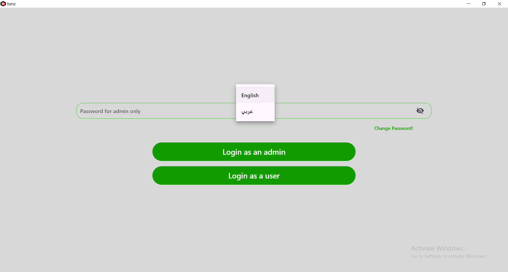

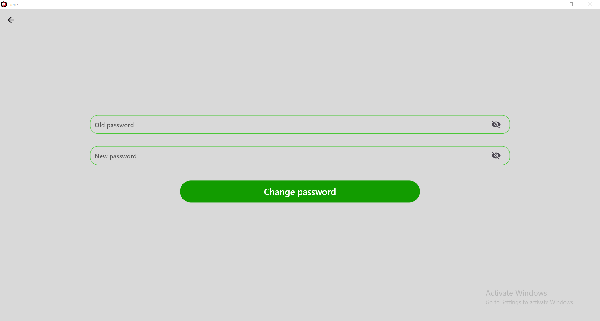

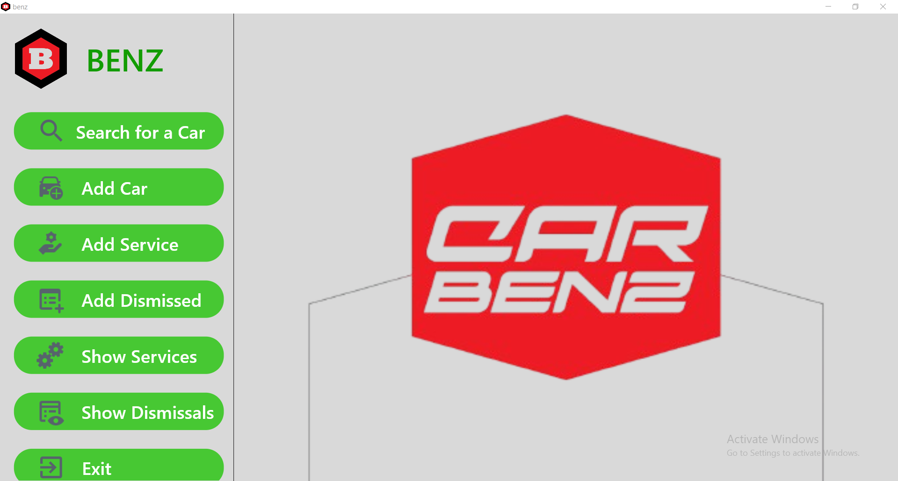

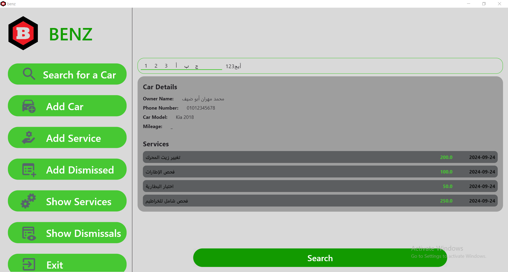

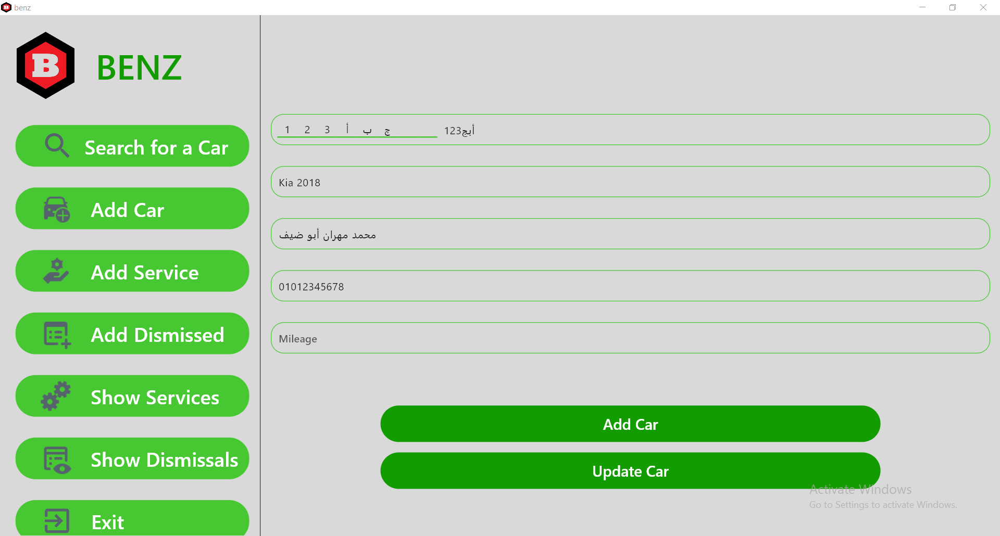

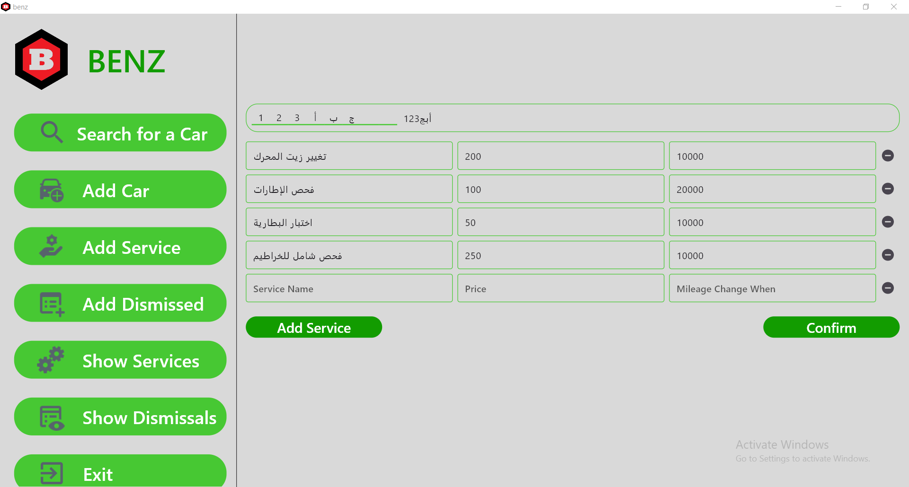

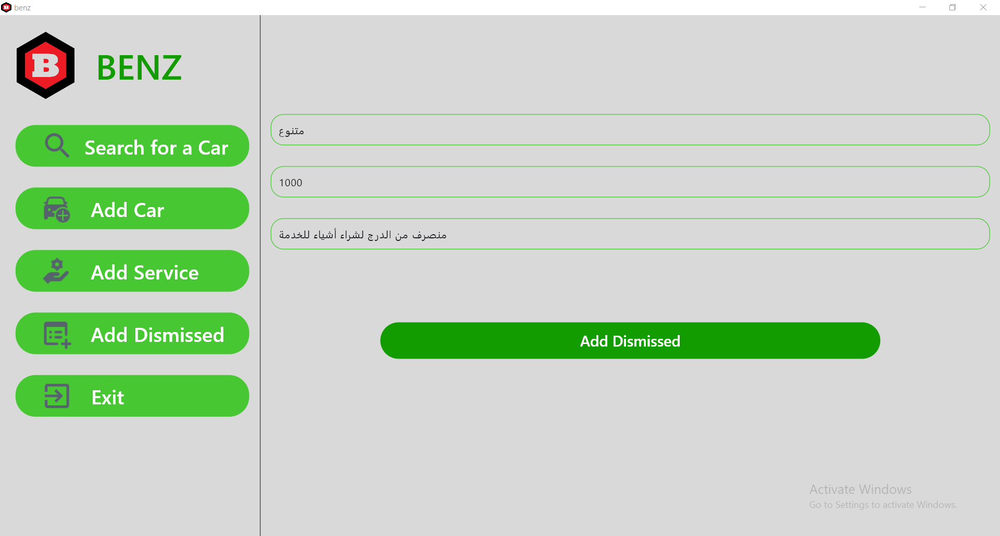

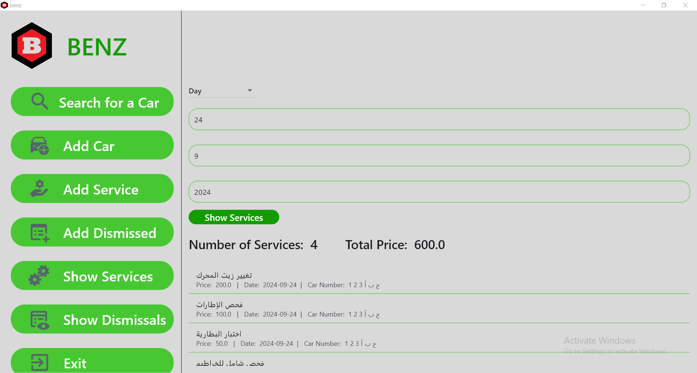

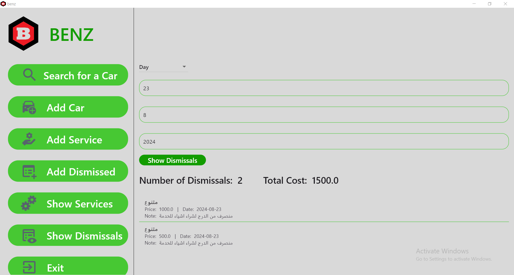

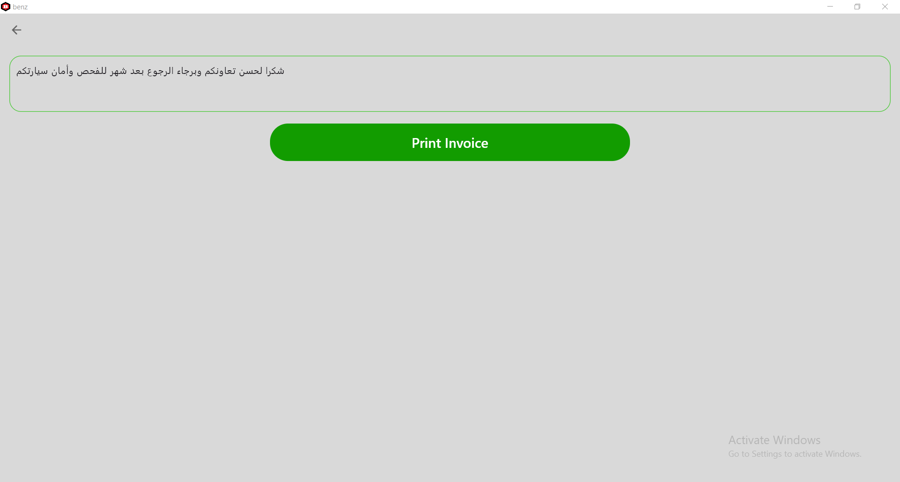

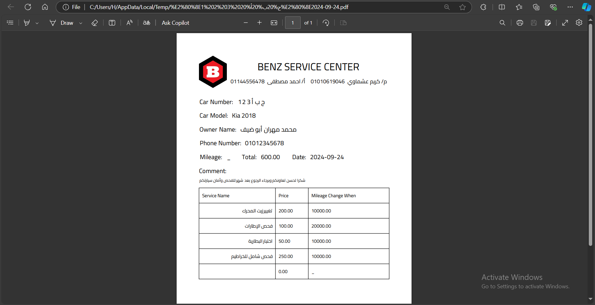


